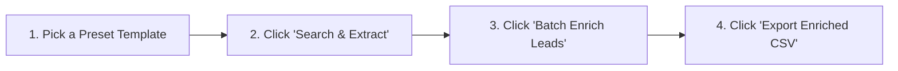

# 📖 Complete Beginner's Walkthrough & User Guide
### *The Dummy-Proof Guide to Google Scraping, Lead Finding & Email Enrichment*

Welcome to the **Multi-Engine Lead & Advanced Dork Extractor Suite**! This guide is written in plain, simple English so anyone can start finding leads, discovering corporate emails, and verifying mailboxes in minutes.

---

## 📑 Table of Contents
1. [What Does This App Do? (In Plain English)](#1-what-does-this-app-do-in-plain-english)
2. [What is "Enrich" & Why Do You Need It?](#2-what-is-enrich--why-do-you-need-it)
3. [Quick Start: 4-Step Walkthrough](#3-quick-start-4-step-walkthrough)
4. [Step-by-Step Guide by Tab](#4-step-by-step-guide-by-tab)
   - [Tab 1: Query Builder & Search](#tab-1-query-builder--search)
   - [Tab 2: Results, Enrichment & Exporting](#tab-2-results-enrichment--exporting)
   - [Tab 3: Search Operators Cheat Sheet](#tab-3-search-operators-cheat-sheet)
   - [Tab 4: Search History & Recall](#tab-4-search-history--recall)
5. [Understanding Deliverability Badges](#5-understanding-deliverability-badges)
6. [Bypassing CAPTCHAs & Google Blocks](#6-bypassing-captchas--google-blocks)
7. [Configuring Enrichment Settings (Custom Domains & APIs)](#7-configuring-enrichment-settings-custom-domains--apis)
8. [Frequently Asked Questions & Troubleshooting](#8-frequently-asked-questions--troubleshooting)

---

## 1. What Does This App Do? (In Plain English)

Normally, finding business leads manually involves:
1. Searching Google or LinkedIn for people (e.g. *"Head of IT at London Fire Brigade"*).
2. Clicking through profiles one by one.
3. Guessing what their email might be.
4. Copying and pasting everything into a spreadsheet.

**This app does all of that automatically:**
- It searches Google, Bing, Brave, or DuckDuckGo using precision search patterns (*"Google Dorks"*).
- It extracts clean contact cards with **Name**, **Job Title**, **Organisation**, and **Profile Link**.
- It discovers and checks their official work email address.
- It verifies if the email actually works via live mail server checks.
- It lets you export everything into an Excel/CSV spreadsheet with 1 click.

---

## 2. What is "Enrich" & Why Do You Need It?

### The Problem
When scraping LinkedIn or Google results, search snippets only show public profile details:
> *"John Smith - Head of ICT at Greater Manchester Fire and Rescue"*

Their email address is **almost never displayed publicly**.

### The Solution: "Enrichment"
**Enrichment** means taking that basic name and company, and automatically completing the missing pieces:

```
[Raw Scrape] John Smith + Greater Manchester Fire and Rescue
     │
     ▼
[Step 1: Domain Lookup]   Matches company to official domain: 'manchesterfire.gov.uk'
     │
     ▼
[Step 2: Email Synthesis] Generates standard corporate format: 'john.smith@manchesterfire.gov.uk'
     │
     ▼
[Step 3: Mail Server Check] Pings official Microsoft 365 / Government DNS MX records
     │
     ▼
[Enriched Result] 🟢 Valid (MX Verified) | john.smith@manchesterfire.gov.uk
```

---

## 3. Quick Start: 4-Step Walkthrough

Follow these 4 simple steps to run your first search and get verified contacts:



### Step 1: Open the App & Choose a Template
1. Run `python scraper_gui.py` to open the app.
2. In **Tab 1**, click the **`⚡ Ready-to-Use Search Templates`** dropdown.
3. Pick a preset (for example: **`Fire & Rescue IT Leaders (UK)`** or **`NHS & Healthcare IT Heads`**).
4. Click **`Apply Template`**.

### Step 2: Run the Search
1. Make sure your Search Engine is set to **Google**, **Brave**, or **DuckDuckGo**.
2. Set **Pages to Scrape** (e.g., `2` or `3`).
3. Click the big blue button: **`🚀 Search & Extract Leads`**.
4. The app will automatically switch to **Tab 2** and start collecting leads.

### Step 3: Enrich Your Leads
1. Once the search finishes, look at your leads in the **📋 Interactive Table**.
2. Click the blue **`⚡ Batch Enrich Leads`** button at the top.
3. Watch the app automatically discover official domains, construct email addresses, and test deliverability with green `🟢 Valid` badges!

### Step 4: Export to Excel / CSV
1. Click **`💾 Export Enriched CSV`**.
2. Choose where to save your file (e.g., `Desktop\enriched_contacts.csv`).
3. Open it in Microsoft Excel, Google Sheets, or import it straight into your CRM!

---

## 4. Step-by-Step Guide by Tab

---

### Tab 1: Query Builder & Search

This tab is your control center for finding contacts.


#### 1. Search Engine Dropdown
- **Google**: Best quality results, but may occasionally show CAPTCHA.
- **Brave Search**: Fast, privacy-focused, zero CAPTCHAs.
- **DuckDuckGo**: Great fallback, no CAPTCHA blocks.
- **Bing**: Excellent for business and Microsoft-indexed profiles.
- **Tor / Ahmia**: Direct darknet / onion network search (requires Tor running).

#### 2. Search Criteria Form
- **Target Site (`site:`)**: Restricts search to a specific domain (e.g. `site:linkedin.com/in/` or `site:gov.uk`).
- **Industry / Keyword**: What sector or company to find (e.g. `"Fire and Rescue"` or `"NHS Trust"`).
  - *Tip: Click `+ Quotes/OR` to format words automatically.*
- **Job Titles / Roles**: Target positions (e.g. `"Head of IT" OR "CTO" OR "Director"`).
- **Location / Region**: Target geography (e.g. `"United Kingdom"`, `"London"`, `"United States"`).
- **Contact Dorks**:
  - Check **`Public Emails`** to prioritize profiles that publicly posted `@gmail` or `@outlook` emails.
  - Check **`Phone / Tel`** to find contacts with phone numbers.
- **Exclude Words (`-`)**: Filter out noise like `-jobs -recruiter -hiring -intern`.
- **Filetype (`filetype:`)**: Filter for downloadable files like `filetype:pdf` (for CVs/resumes) or `filetype:xls`.

#### 3. Browser Display Options
- **👻 Silent (No Window - Default)**: Chrome runs completely invisibly in the background.
- **🔘 Minimized Corner**: Keeps Chrome parked as a tiny box in the bottom-right corner of your screen.
- **🖥️ Normal Window**: Opens standard Chrome window (great if you need to manually solve a CAPTCHA).

---

### Tab 2: Results, Enrichment & Exporting

This tab shows all your collected leads.

#### Display Views
Switch views using the radio buttons at the top:
- **📋 Interactive Table (Default)**: Full spreadsheet-style view with columns for Name, Role, Organisation, Enriched Email, Deliverability Badge, Domain, and Profile URL.
- **🃏 Structured Cards**: Clean visual text cards for each person.
- **📊 Excel TSV / 📑 CSV Format**: Plain tab-separated or comma-separated text.
- **✉️ Emails Only**: A clean list of only email addresses, ready for bulk copy.
- **🔗 URLs Only**: A list of source URLs.

#### ⚡ Column Sorting & Categorisation
- **Click any Column Title to Sort**: Click **`Organisation / Service`** to immediately group all identical companies together in alphabetical order (**▲ A-Z**). Click it again to reverse order (**▼ Z-A**). You can sort by Name, Job Role, Deliverability Status, or Email just as easily.
- **🏢 Filter by Organisation**: Select any company from the **`🏢 Organisation:`** dropdown to show only contacts belonging to that specific employer (with live lead count badges).
- **🛡️ Filter by Status**: Select from the **`🛡️ Status:`** dropdown to view only verified emails (`🟢 Valid Only`), unverified (`🟡 Risky Only`), or missing domains.
- **🔍 Free-Text Filter**: Type any keyword into the search filter to narrow down results live.
- **🔄 Reset Filters**: 1-click button to restore all filters and sorting back to default.

#### 👥 Multi-Line Selection & Batch Operations
- **Select Multiple Contacts**: Hold **`Ctrl`** (to pick individual rows) or **`Shift`** (to select a range of rows) in the Interactive Table.
- **Enrich Selected**: Click **`⚡ Enrich Selected`** to process and verify emails for all your selected contacts at once.
- **Right-Click Context Menu**: Right-click on any contact in the table to:
  - ⚡ *Enrich Selected Contact(s)*
  - 🏢 *Filter Table by this Organisation*
  - ✉️ *Copy Email Address*
  - 📋 *Copy Full Row Details*
  - 🌐 *Open LinkedIn Profile in Web Browser*

#### Enrichment Action Buttons
| Button | What it does |
| :--- | :--- |
| **`⚡ Batch Enrich All`** | Automatically loops through **every lead** in your table, finds their company domain, generates work emails, and checks mail server deliverability. |
| **`⚡ Enrich Selected`** | Enriches and verifies MX deliverability for **all selected rows** (single or multiple lines). |
| **`⚙️ Enrichment Settings`** | Lets you change the industry domain database, email formula pattern, or add API keys. |
| **`💾 Export Enriched CSV`** | Exports full dataset with verified emails, deliverability status, and MX server hosts. |

---

### Tab 3: Search Operators Cheat Sheet

Need inspiration for advanced searches?
- Tab 3 contains an interactive library of Google Dork operators (`site:`, `inurl:`, `intitle:`, `filetype:`, `before:`, `after:`, etc.).
- **Smooth Mouse Wheel Scrolling**: Scroll up and down effortlessly through all operator guides and ready-made dork templates.
- Click **`⚡ Load into Builder`** on any recipe to instantly load pre-built searches into Tab 1.

---

### Tab 4: Search History & Recall

- Every search you run is automatically saved with a timestamp and search engine tag.
- If you ran a great search yesterday and want to run it again:
  1. Go to **Tab 4 (History Log)**.
  2. Click on the past query.
  3. Click **`⚡ Recall Selected into Builder`**.

---

## 5. Understanding Deliverability Badges

When you run **Enrichment**, each contact receives a color-coded status badge:

| Badge | Meaning | Action Recommended |
| :--- | :--- | :--- |
| `🟢 Valid (MX Verified)` | **100% Verified.** The domain is active and the mail server (e.g. Microsoft 365, Mimecast, Google Workspace) confirmed it accepts emails. | **Safe for outreach / CRM.** Zero bounce risk. |
| `🟡 Risky` | **Catch-all or Unverified.** The domain exists and has an active mail server, but the server does not disclose specific mailbox verification. | Safe to email, but monitor for bounces. |
| `⚪ Not Found` | **Missing Domain.** The organisation name could not be mapped to an official registry or domain. | Add a fallback domain in **⚙️ Settings** or enter company domain manually. |
| `🔴 Invalid (No MX)` | **Dead Domain.** The domain does not have active mail exchange (MX) DNS records configured. | Do not send emails to this address. |

---

## 6. Bypassing CAPTCHAs & Google Blocks

If Google asks for a CAPTCHA verification when scraping:

### Method 1: Use 1-Click Google Login (Permanent Solution)
1. In Tab 1, click **`🔑 Log in to Google`**.
2. A Chrome window will open. Log into your standard Google Account.
3. Close the browser window when done.
4. The scraper now remembers your authenticated session cookies. Google will treat your searches as a real logged-in human user!

### Method 2: Switch to Non-CAPTCHA Engines
- In the **Search Engine** dropdown, choose **`🦁 Brave Search`**, **`🟦 Bing`**, or **`🦆 DuckDuckGo`**.
- These search engines do not throw automated CAPTCHA challenges.

### Method 3: Smart Auto-Popup
- If a CAPTCHA appears while running in *Silent* mode, the app will automatically pop up a window for you to click the checkbox, and then minimize itself again once solved!

---

## 7. Configuring Enrichment Settings (Custom Domains & APIs)

Click **`⚙️ Enrichment Settings`** in Tab 2 to customize:

### 1. Target Industry Registry
Choose built-in domain dictionaries:
- **🚒 UK Fire & Rescue Services**: Automatically maps all 50+ UK services (`london-fire.gov.uk`, `manchesterfire.gov.uk`, `wmfs.net`, etc.).
- **🏥 NHS Trusts & Health Boards**: Maps hospitals to official `.nhs.uk` domains.
- **🏛️ UK Local Councils**: Maps borough, county, and city councils to `.gov.uk`.
- **👮 UK Police Constabularies**: Maps forces to `.police.uk`.
- **🏢 Custom Domain Fallback**: Specify any domain (e.g. `acme-corp.com`) to use for companies not in the registry.

### 2. Corporate Email Pattern Formula
Pick the naming standard used by your target organisation:
- `{first}.{last}@{domain}` *(e.g. `john.smith@london-fire.gov.uk` - UK Public Sector Standard)*
- `{f}{last}@{domain}` *(e.g. `jsmith@company.com`)*
- `{first}{last}@{domain}` *(e.g. `johnsmith@company.com`)*
- `{first}_{last}@{domain}` *(e.g. `john_smith@company.com`)*
- `{last}.{first}@{domain}` *(e.g. `smith.john@company.com`)*

### 3. External API Integration (Optional)
By default, the app uses its **100% Free Built-in DNS MX Verifier**.
If you have an account with external enrichment tools, you can plug in your API key:
- **Hunter.io API**
- **Apollo.io API**
- **Snov.io API**

---

## 8. Frequently Asked Questions & Troubleshooting

### Q: Why is my email showing as "⚪ Not Found"?
**A:** The organisation name in the LinkedIn snippet might be shortened or not in the default registry. 
*Fix:* Open **⚙️ Enrichment Settings** and enter a **Custom Domain Fallback** (e.g. `example.com`), then run **`⚡ Batch Enrich Leads`** again.

### Q: How many pages should I scrape?
**A:** We recommend **2 to 5 pages** per search. Scraping 20+ pages rapidly on Google can trigger temporary rate limits. Set the **Delay (sec)** to `2.0` or `3.0` for smooth scraping.

### Q: Where do exported CSV files go?
**A:** When you click **`💾 Export Enriched CSV`**, a file dialog will appear asking you where you want to save it (e.g. your Desktop or Documents folder).

### Q: Can I run this without installing Chrome?
**A:** The app uses Google Chrome via Selenium for JavaScript rendering and anti-bot protection. If Chrome is not installed, it falls back to basic direct HTTP requests.

---

*Enjoy lead prospecting and email enrichment! For technical questions or issues, consult [README.md](file:///c:/Users/uyko7/Documents/VSCode/Google%20Scrape/README.md) or check the code in [scraper_gui.py](file:///c:/Users/uyko7/Documents/VSCode/Google%20Scrape/scraper_gui.py).*
