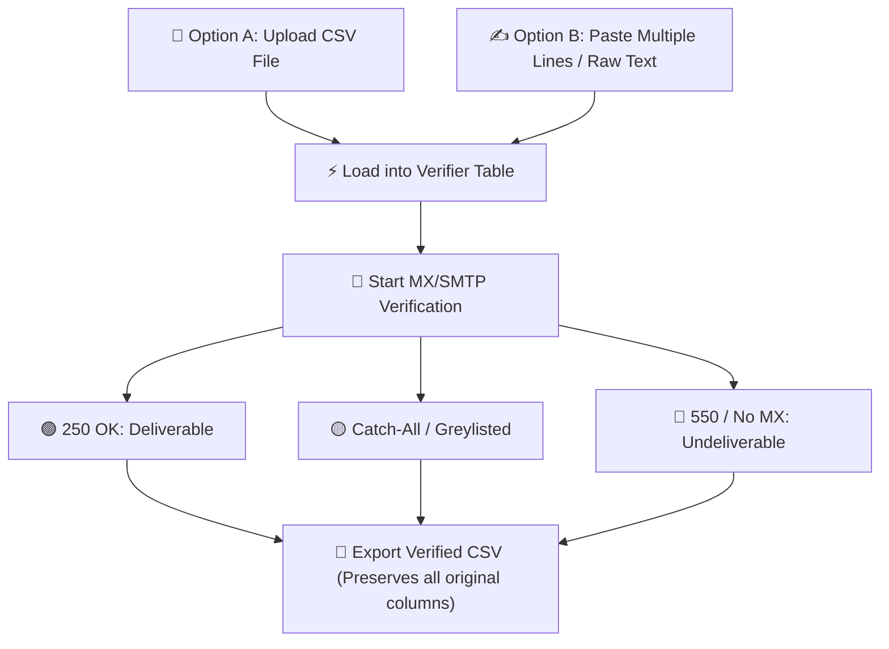
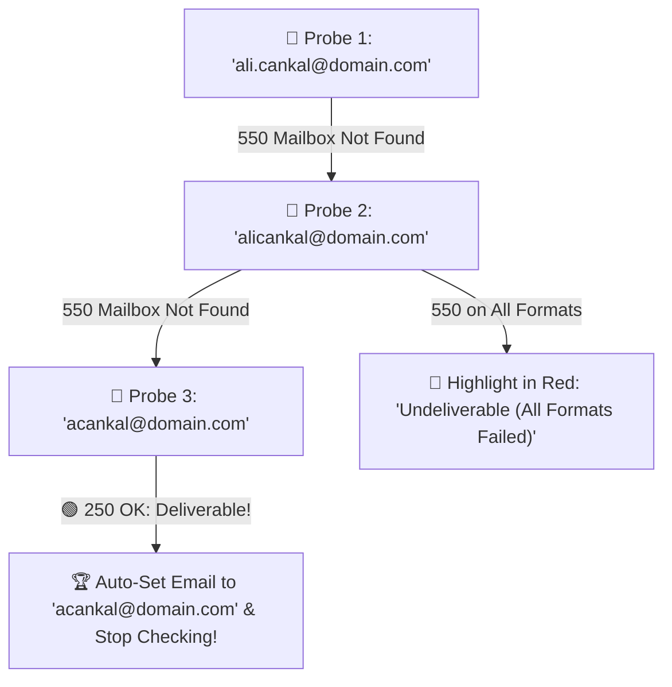
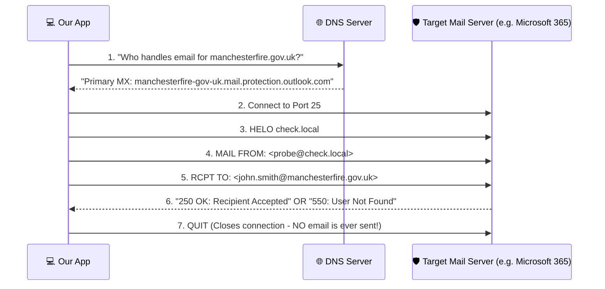
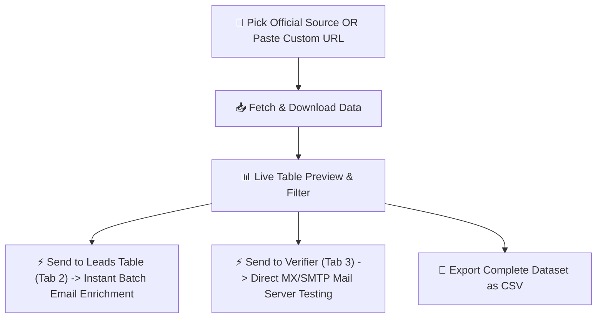

# 📖 Complete Beginner's Walkthrough & User Guide
### *The Dummy-Proof Guide to Google Scraping, Lead Finding & Email Enrichment*

Welcome to the **Multi-Engine Lead & Advanced Dork Extractor Suite**! This guide is written in plain, simple English so anyone can start finding leads, discovering corporate emails, and verifying mailboxes in minutes.

---

## 📑 Table of Contents
1. [What Does This App Do? (In Plain English)](#1-what-does-this-app-do-in-plain-english)
2. [What is "Enrich" & Why Do You Need It?](#2-what-is-enrich--why-do-you-need-it)
3. [Quick Start: 4-Step Walkthrough](#3-quick-start-4-step-walkthrough)
4. [Step-by-Step Guide by Tab](#4-step-by-step-guide-by-tab)
   - [Tab 1: Query Builder & Search](#tab-1-query-builder--search)
   - [Tab 2: Results, Enrichment & Exporting](#tab-2-results-enrichment--exporting)
   - [Tab 3: Email & CSV Verifier (MX & SMTP Handshake)](#tab-3-email--csv-verifier-mx--smtp-handshake)
   - [Tab 4: Direct Open Data & Public Registers (CSV/ZIP/Directories)](#tab-4-direct-open-data--public-registers-csvzipdirectories)
   - [Tab 5: Search Operators Cheat Sheet](#tab-5-search-operators-cheat-sheet)
   - [Tab 6: Search Query History Log](#tab-6-search-query-history-log)
5. [Understanding Deliverability Badges](#5-understanding-deliverability-badges)
6. [Bypassing CAPTCHAs & Google Blocks](#6-bypassing-captchas--google-blocks)
7. [Configuring Enrichment Settings (Custom Domains & APIs)](#7-configuring-enrichment-settings-custom-domains--apis)
8. [Frequently Asked Questions & Troubleshooting](#8-frequently-asked-questions--troubleshooting)

---

## 1. What Does This App Do? (In Plain English)

Normally, finding business leads manually involves:
1. Searching Google or LinkedIn for people (e.g. *"Head of IT at London Fire Brigade"*).
2. Clicking through profiles one by one.
3. Guessing what their email might be.
4. Copying and pasting everything into a spreadsheet.

**This app does all of that automatically:**
- It searches Google, Bing, Brave, or DuckDuckGo using precision search patterns (*"Google Dorks"*).
- It extracts clean contact cards with **Name**, **Job Title**, **Organisation**, and **Profile Link**.
- It discovers and checks their official work email address.
- It verifies if the email actually works via live mail server checks.
- It lets you export everything into an Excel/CSV spreadsheet with 1 click.

---

## 2. What is "Enrich" & Why Do You Need It?

### The Problem
When scraping LinkedIn or Google results, search snippets only show public profile details:
> *"John Smith - Head of ICT at Greater Manchester Fire and Rescue"*

Their email address is **almost never displayed publicly**.

### The Solution: "Enrichment"
**Enrichment** means taking that basic name and company, and automatically completing the missing pieces:

```
[Raw Scrape] John Smith + Greater Manchester Fire and Rescue
     │
     ▼
[Step 1: Domain Lookup]   Matches company to official domain: 'manchesterfire.gov.uk'
     │
     ▼
[Step 2: Email Synthesis] Generates standard corporate format: 'john.smith@manchesterfire.gov.uk'
     │
     ▼
[Step 3: Mail Server Check] Pings official Microsoft 365 / Government DNS MX records
     │
     ▼
[Enriched Result] 🟢 Valid (MX Verified) | john.smith@manchesterfire.gov.uk
```

---

## 3. Quick Start: 4-Step Walkthrough

Follow these 4 simple steps to run your first search and get verified contacts:


```mermaid
graph LR
    A["1. Pick a Preset Template"] --> B["2. Click 'Search & Extract'"]
    B --> C["3. Click 'Batch Enrich Leads'"]
    C --> D["4. Click 'Export Enriched CSV'"]
```

### Step 1: Open the App & Choose a Template
1. Run `python scraper_gui.py` to open the app.
2. In **Tab 1**, click the **`⚡ Ready-to-Use Search Templates`** dropdown.
3. Pick a preset (for example: **`Fire & Rescue IT Leaders (UK)`** or **`NHS & Healthcare IT Heads`**).
4. Click **`Apply Template`**.

### Step 2: Run the Search
1. Make sure your Search Engine is set to **Google**, **Brave**, or **DuckDuckGo**.
2. Set **Pages to Scrape** (e.g., `2` or `3`).
3. Click the big blue button: **`🚀 Search & Extract Leads`**.
4. The app will automatically switch to **Tab 2** and start collecting leads.

### Step 3: Enrich Your Leads
1. Once the search finishes, look at your leads in the **📋 Interactive Table**.
2. Click the blue **`⚡ Batch Enrich Leads`** button at the top.
3. Watch the app automatically discover official domains, construct email addresses, and test deliverability with green `🟢 Valid` badges!

### Step 4: Export to Excel / CSV
1. Click **`💾 Export Enriched CSV`**.
2. Choose where to save your file (e.g., `Desktop\enriched_contacts.csv`).
3. Open it in Microsoft Excel, Google Sheets, or import it straight into your CRM!

---

## 4. Step-by-Step Guide by Tab

---

### Tab 1: Query Builder & Search

This tab is your control center for finding contacts.


#### 1. Search Engine Dropdown
- **Google**: Best quality results, but may occasionally show CAPTCHA.
- **Brave Search**: Fast, privacy-focused, zero CAPTCHAs.
- **DuckDuckGo**: Great fallback, no CAPTCHA blocks.
- **Bing**: Excellent for business and Microsoft-indexed profiles.
- **Tor / Ahmia**: Direct darknet / onion network search (requires Tor running).

#### 2. Search Criteria & Strategy Selector (Sub-Tabs)

The Search Criteria section features two dedicated strategy tabs:

##### 🎯 Sub-Tab 1: Targeted Site & Profile Search (`site:`)
Best for laser-focused searches on a specific platform (like LinkedIn profiles, GitHub, government portals, or single domains):
- **Target Site (`site:`)**: Restricts search to a specific domain. Choose from presets like:
  - `site:environment.data.gov.uk/public-register/` *(England - Environment Agency Public Register)*
  - `site:sepa.org.uk` *(Scotland - Scottish Environment Protection Agency)*
  - `site:naturalresources.wales` *(Wales - Natural Resources Wales / Cyfoeth Naturiol Cymru)*
  - `(site:environment.data.gov.uk/public-register/ OR site:sepa.org.uk OR site:naturalresources.wales)` *(Combined UK Regulators)*
  - `site:linkedin.com/in/`, `site:gov.uk`, `site:github.com`, etc.
- **Industry / Keyword**: What sector or company to find (e.g. `"Fire and Rescue"`, `"NHS Trust"`, or `"Environmental Permitting Regulations – Waste Operations"`).
  - *Tip: Click `+ Quotes/OR` to format words automatically.*
- **Job Titles / Roles**: Target positions (e.g. `"Head of IT" OR "CTO" OR "Director"`, or carrier roles like `"Carrier and Broker" OR "Dealer"`).
- **Location / Region**: Target geography (e.g. `"United Kingdom"`, `"London"`, `"United States"`, or company forms like `"Limited" OR "Ltd" OR "PLC"`).
- **Contact Dorks**:
  - Check **`Public Emails`** to prioritize profiles that publicly posted `@gmail` or `@outlook` emails.
  - Check **`Phone / Tel`** to find contacts with phone numbers.
- **Exclude Words (`-`)**: Filter out noise like `-jobs -recruiter -hiring -intern`, `-council -civic -household -tip -hwrc`, or `-council -individual`.
- **Filetype (`filetype:`)**: Filter for downloadable files like `filetype:pdf` (for CVs/resumes) or `filetype:xls`.

##### ♻️ Pre-Configured UK Environmental Protection Agency Templates
Quickly accessible via the **`Load Template:`** dropdown in Tab 1 or the **Cheatsheet (Tab 4)**:
1. **🏴󠁧󠁢󠁥󠁮󠁧󠁿 EA: Waste Permitting & Operations (England)**:
   - Query: `site:environment.data.gov.uk/public-register/ ("Environmental Permitting Regulations – Waste Operations" OR "Materials recovery" OR "Waste transfer") -council -civic -household -tip -hwrc`
   - *Targets*: Commercial materials recovery facilities (MRFs), waste transfer stations, and permitted waste processors across England, excluding municipal tips.
2. **🏴󠁧󠁢󠁥󠁮󠁧󠁿 EA: Waste Carriers, Brokers & Dealers (England)**:
   - Query: `site:environment.data.gov.uk/public-register/ "Register of Waste Carriers, Brokers and Dealers" ("Carrier and Broker" OR "Dealer") ("Limited" OR "Ltd" OR "PLC") -council -individual`
   - *Targets*: Commercial waste transport companies, registered brokers, and scrap dealers (filtered specifically for Ltd/PLC registered companies).
3. **🏴󠁧󠁢󠁳󠁣󠁴󠁿 SEPA: Waste Carriers & Authorisations (Scotland)**:
   - Query: `site:sepa.org.uk ("Register of Waste Carriers" OR "authorisations" OR "waste transfer" OR "materials recovery") ("Limited" OR "Ltd" OR "PLC") -council`
   - *Targets*: Scottish Environment Protection Agency registered waste carriers, commercial transfer stations, and material recovery facilities in Scotland.
4. **🏴󠁧󠁢󠁷󠁬󠁳󠁿 NRW: Waste Permitting & Carriers (Wales)**:
   - Query: `site:naturalresources.wales ("waste permitting" OR "waste carriers, brokers and dealers" OR "waste transfer") ("Limited" OR "Ltd" OR "PLC") -council -cyngor`
   - *Targets*: Natural Resources Wales / Cyfoeth Naturiol Cymru permitted facilities, brokers, and carriers with bilingual exclusions.
5. **🇬🇧 Combined UK Regulators (EA / SEPA / NRW)**:
   - Query: `(site:environment.data.gov.uk/public-register/ OR site:sepa.org.uk OR site:naturalresources.wales) ("waste operations" OR "materials recovery" OR "waste transfer station" OR "waste carrier") ("Limited" OR "Ltd" OR "PLC") -council -cyngor -civic -household -tip -hwrc`
   - *Targets*: Cross-UK unified search covering England, Scotland, and Wales in a single query.
6. **🛣️ National Highways Leaders & Project Directors (UK)**:
   - Query: `site:linkedin.com/in/ ("National Highways" OR "Highways England" OR "Highways Agency") ("Project Director" OR "Programme Director" OR "Head of" OR "Commercial Director" OR "Operations Manager" OR "Head of IT" OR "Procurement") "United Kingdom" -jobs -recruiter -recruiting -careers`
   - *Targets*: Key decision-makers, commercial heads, IT leaders, and programme directors across National Highways.
7. **🛣️ National Highways: Schemes, Tenders & Contacts**:
   - Query: `site:nationalhighways.co.uk ("procurement" OR "framework contracts" OR "commercial" OR "schemes" OR "consultation") ("Director" OR "Head of" OR "Project Manager" OR "Commercial Manager" OR "Contact") -careers -vacancies`
   - *Targets*: Official National Highways contract frameworks, major road project schemes, and named departmental points of contact.
8. **🛣️ National Highways & Road Network Depots (UK)**:
   - Query: `("National Highways" OR "Highways England" OR "Strategic Road Network" OR "major road network" OR "highways contractor") ("regional operations centre" OR "maintenance depot" OR "outstation" OR "framework supplier" OR "head office") ("United Kingdom" OR "UK" OR "England" OR "Scotland" OR "Wales") -council -household -tip -hwrc -vacancies -careers`
   - *Targets*: Outstations, regional control centres, maintenance facilities, and infrastructure contractors across the UK strategic road network.

##### 🌐 Sub-Tab 2: Generalized Industry & Facility Search (Multi-Group Boolean)
Best for discovering commercial operations, industrial facilities, distribution networks, fleet depots, and multi-site companies across the open web using structured multi-group boolean operators:
- **⭐ 1-Click Waste & Facility Example**: Click the button at the top to instantly load:
  `("Materials Recovery Facility" OR "waste transfer station" OR "commercial recycling facility") ("multiple sites" OR "depots across" OR "nationwide" OR "head office") ("United Kingdom" OR "UK" OR "England" OR "Scotland" OR "Wales") -council -civic -household -tip -hwrc -.gov.uk`
- **Group 1: Facility / Industry Terms (OR)**: Enter facility types or pick presets (e.g., *Materials Recovery & Waste Facilities*, *Logistics & Distribution Warehouses*, *Fleet Operating Depots*, *Manufacturing Plants*, *Energy & Biomass*, *Data Centers*, *Chemical/COMAH Sites*, *Scrap & Metal Recycling*).
- **Group 2: Operational Scale & Multi-Site Scope (OR)**: Define footprint requirements or pick presets (*Multi-Site & Nationwide*, *Regional Hubs & Depots*, *Corporate HQ*, *UK-Wide Coverage*).
- **Group 3: Geographic & Country Filter (OR)**: Define national/regional boundaries (*UK & Home Nations*, *England & London*, *Scotland & NI*, *USA Nationwide*, *Europe*).
- **Group 4: Negative Exclusions & Cleaners (-)**: Filter out unwanted public or consumer sites (*Exclude Municipal/Council Tips & .gov.uk*, *Exclude Job Boards*, *Exclude Public Sector*, *Exclude Directories*).
- **Optional Modifiers**: Add `intext:` or `inurl:` filters, filetype extensions, or public email/phone hunters.

#### 3. Browser Display Options
- **👻 Silent (No Window - Default)**: Chrome runs completely invisibly in the background.
- **🔘 Minimized Corner**: Keeps Chrome parked as a tiny box in the bottom-right corner of your screen.
- **🖥️ Normal Window**: Opens standard Chrome window (great if you need to manually solve a CAPTCHA).

---

### Tab 2: Results, Enrichment & Exporting

This tab shows all your collected leads.

#### Display Views
Switch views using the radio buttons at the top:
- **📋 Interactive Table (Default)**: Full spreadsheet-style view with columns for Name, Role, Organisation, Enriched Email, Deliverability Badge, Domain, and Profile URL.
- **🃏 Structured Cards**: Clean visual text cards for each person.
- **📊 Excel TSV / 📑 CSV Format**: Plain tab-separated or comma-separated text.
- **✉️ Emails Only**: A clean list of only email addresses, ready for bulk copy.
- **🔗 URLs Only**: A list of source URLs.

#### ⚡ Column Sorting & Categorisation
- **Click any Column Title to Sort**: Click **`Organisation / Service`** to immediately group all identical companies together in alphabetical order (**▲ A-Z**). Click it again to reverse order (**▼ Z-A**). You can sort by Name, Job Role, Deliverability Status, or Email just as easily.
- **🏢 Filter by Organisation**: Select any company from the **`🏢 Organisation:`** dropdown to show only contacts belonging to that specific employer (with live lead count badges).
- **🛡️ Filter by Status**: Select from the **`🛡️ Status:`** dropdown to view only verified emails (`🟢 Valid Only`), unverified (`🟡 Risky Only`), or missing domains.
- **🔍 Free-Text Filter**: Type any keyword into the search filter to narrow down results live.
- **🔄 Reset Filters**: 1-click button to restore all filters and sorting back to default.

#### 👥 Multi-Line Selection & Batch Operations
- **Select Multiple Contacts**: Hold **`Ctrl`** (to pick individual rows) or **`Shift`** (to select a range of rows) in the Interactive Table.
- **Enrich Selected**: Click **`⚡ Enrich Selected`** to process and verify emails for all your selected contacts at once.
- **Right-Click Context Menu**: Right-click on any contact in the table to:
  - ⚡ *Enrich Selected Contact(s)*
  - 🏢 *Filter Table by this Organisation*
  - ✉️ *Copy Email Address*
  - 📋 *Copy Full Row Details*
  - 🌐 *Open LinkedIn Profile in Web Browser*

#### Enrichment Action Buttons
| Button | What it does |
| :--- | :--- |
| **`⚡ Batch Enrich All`** | Automatically loops through **every lead** in your table, finds their company domain, generates work emails, and checks mail server deliverability. |
| **`⚡ Enrich Selected`** | Enriches and verifies MX deliverability for **all selected rows** (single or multiple lines). |
| **`⚙️ Enrichment Settings`** | Lets you change the industry domain database, email formula pattern, or add API keys. |
| **`💾 Export Enriched CSV`** | Exports full dataset with verified emails, deliverability status, and MX server hosts. |

---

### Tab 3: Email & CSV Verifier (MX & SMTP Handshake)

This dedicated verifier allows you to test any list of email addresses using direct **DNS MX resolution** and a live **SMTP Handshake** (`HELO` ➔ `MAIL FROM` ➔ `RCPT TO` ➔ `250 OK / 550 Mailbox Not Found`) without sending actual test emails.

You have two easy ways to feed emails into the verifier:


```mermaid
graph TD
    A1["📂 Option A: Upload CSV File"] --> C["⚡ Load into Verifier Table"]
    A2["✍️ Option B: Paste Multiple Lines / Raw Text"] --> C
    C --> D["🚀 Start MX/SMTP Verification"]
    D --> E1["🟢 250 OK: Deliverable"]
    D --> E2["🟡 Catch-All / Greylisted"]
    D --> E3["🔴 550 / No MX: Undeliverable"]
    E1 --> F["💾 Export Verified CSV (Preserves all original columns)"]
    E2 --> F
    E3 --> F
```

#### 📂 Option A: Import a CSV File (e.g. `Chief_Fire_Officers.csv`)
1. Select the **`📂 Option A: Import CSV File`** radio button.
2. Click **`📂 Browse CSV...`** and choose your spreadsheet file.
3. The app automatically scans your headers and picks your email column (e.g. `Emails`, `Enriched Email`, `Contact_Email`). If needed, pick the desired column from the dropdown.
4. Click **`⚡ Load CSV into Verifier`**.
5. All rows will appear in the interactive table ready for checking.

#### ✍️ Option B: Paste Multiple Emails (Text Box)
1. Select the **`✍️ Option B: Paste Multiple Emails / Text Box`** radio button.
2. Paste any list into the text area. You can paste:
   - One email per line:
     ```text
     john.smith@manchesterfire.gov.uk
     sarah.connor@london-fire.gov.uk
     ```
   - Comma-separated or tab-separated text:
     ```text
     john@example.com, alex@example.org, contact@test.co.uk
     ```
   - Lines with names or titles:
     ```text
     Chief Fire Officer John Smith, cfo@cumbriafire.gov.uk
     Director Jane Doe <jane.doe@bucksfire.gov.uk>
     ```
3. Click **`⚡ Load Pasted Emails into Verifier`**.

#### Running Verification & Analyzing Results
1. *(Optional)* Adjust **Timeout (sec)** (default: `8s`) or enable **`Detect Catch-All Mailboxes`**.
2. Click **`🚀 Start MX/SMTP Verification`**.
3. Watch the progress bar and real-time live counters:
   - `🟢 Deliverable`: Mail server replied with `250 OK` (mailbox is 100% active).
   - `🟡 Catch-All / Greylisted`: Domain accepts all mail or has temporary anti-spam delay.
   - `🔴 Undeliverable`: Domain does not exist or server returned `550 User Not Found`.
4. **Inspect Server Logs**: Double-click any row to open the **Handshake Details** dialog to inspect raw SMTP server responses, latency in milliseconds, and MX host.
5. **Sort & Filter**: Click any column header to sort alphabetically, or type in the **Filter Table** box to narrow down leads.
6. **Export**: Click **`💾 Export Verified CSV`** to save your verified file. If you imported a CSV, **all of your original columns are 100% preserved**, with new verification columns appended!
7. **Copy**: Click **`✉️ Copy Deliverable Only`** to copy all clean `🟢 250 OK` email addresses directly to your clipboard.

#### ⚡ 1-Click Auto-Waterfall Permutation Discovery (Automatic Format Finder)

Instead of manually guessing email formats, the app includes an **Auto-Waterfall Permutation Engine**:


```mermaid
graph TD
    A["📧 Probe 1: 'ali.cankal@domain.com'"] -->|550 Mailbox Not Found| B["📧 Probe 2: 'alicankal@domain.com'"]
    B -->|550 Mailbox Not Found| C["📧 Probe 3: 'acankal@domain.com'"]
    C -->|🟢 250 OK: Deliverable!| D["🏆 Auto-Set Email to 'acankal@domain.com' & Stop Checking!"]
    B -->|550 on All Formats| E["🔴 Highlight in Red: 'Undeliverable (All Formats Failed)'"]
```

**How It Works:**
1. Keep **`⚡ Auto-Waterfall Retry on 550`** checked in Tab 3 (enabled by default).
2. Click **`🚀 Start MX/SMTP Verification`**.
3. If an address fails with `550`, the engine automatically tests the person's name against all major corporate formulas in prioritized sequence:
   - `first.last` (`ali.cankal@domain.com`)
   - `firstlast` without dot (`alicankal@domain.com`)
   - `flast` initial + last (`acankal@domain.com`)
   - `first_last` underscore (`ali_cankal@domain.com`)
   - `last.first` (`cankal.ali@domain.com`)
   - `lastf` (`cankala@domain.com`)
   - `first` (`ali@domain.com`)
4. **Instant Lock-In**: As soon as any format returns `🟢 250 OK (Deliverable)`, the app automatically updates the contact's email to that working address and stops probing!
5. **If All Fail**: If every single pattern returns `550`, the contact is highlighted in red with the status `🔴 Undeliverable (All 7 Formats Failed)`.

#### 🔄 Manual Pattern Studio & Custom Reformatting

If you want to manually inspect and experiment with specific pattern formulas:
1. Click the purple **`🔄 Reformat & Retry Undeliverables...`** button (or right-click any row and choose **`🔄 Reformat & Retry...`**).
2. A dedicated studio window will open, automatically loading all failed/undeliverable contacts.
3. Click **`✨ 1-Click Auto-Waterfall All Formats`** to automatically test and discover working formats for everyone in the list simultaneously.
4. Or select your desired new pattern from the dropdown / quick buttons (`⚡ 'alicankal'`, `⚡ 'acankal'`, `⚡ 'ali_cankal'`).
5. Click **`📥 Apply & Update Main Table`** to replace undeliverables with your newly discovered valid emails in your main table, or click **`💾 Export Reformatted CSV`** to save them directly.

#### 🔬 How the Direct MX & SMTP Handshake Works (Under the Hood)
The app connects directly to the recipient's official mail server without sending any test emails or using expensive third-party APIs:


```mermaid
sequenceDiagram
    participant App as 💻 Our App
    participant DNS as 🌐 DNS Server
    participant MX as 🛡️ Target Mail Server (e.g. Microsoft 365)
    
    App->>DNS: 1. "Who handles email for manchesterfire.gov.uk?"
    DNS-->>App: "Primary MX: manchesterfire-gov-uk.mail.protection.outlook.com"
    App->>MX: 2. Connect to Port 25
    App->>MX: 3. HELO check.local
    App->>MX: 4. MAIL FROM: <probe@check.local>
    App->>MX: 5. RCPT TO: <john.smith@manchesterfire.gov.uk>
    MX-->>App: 6. "250 OK: Recipient Accepted" OR "550: User Not Found"
    App->>MX: 7. QUIT (Closes connection - NO email is ever sent!)
```

> [!TIP]
> **Why Direct Verification is Better than Third-Party APIs:**
> - **100% Free & Unlimited**: No monthly subscription fees or credit limits (unlike services that charge per 1,000 verifications).
> - **Complete Privacy**: Your contact lists and corporate emails remain local on your machine and are never uploaded to third-party databases.
> - **Zero Configuration**: No API keys or account registrations needed.

---

### Tab 4: Direct Open Data & Public Registers (CSV/ZIP/Directories)

Why scrape Google result pages one by one when government agencies and national directories publish the **complete official registers for direct bulk download**?

Tab 4 allows you to pull complete datasets (thousands of companies, permit numbers, postcodes, and leadership contacts) directly into the app with zero CAPTCHAs, zero rate limits, and zero search engine blocks.


```mermaid
graph TD
    A["📜 Pick Official Source OR Paste Custom URL"] --> B["📥 Fetch & Download Data"]
    B --> C["📊 Live Table Preview & Filter"]
    C --> D1["⚡ Send to Leads Table (Tab 2) -> Instant Batch Email Enrichment"]
    C --> D2["⚡ Send to Verifier (Tab 3) -> Direct MX/SMTP Mail Server Testing"]
    C --> D3["💾 Export Complete Dataset as CSV"]
```

#### 1. Pre-Configured Official Direct Register Downloads & Portals

Select any of the built-in official open data sources from the **`📜 Select Source:`** dropdown:

| Registry Source | Jurisdiction | Format | Description |
| :--- | :--- | :--- | :--- |
| **🏴󠁧󠁢󠁥󠁮󠁧󠁿 EA: Permitted Waste Operations** | England (Environment Agency) | Direct `.zip` archive / CSV | Complete national open dataset of all permitted waste processing sites, materials recovery facilities (MRFs), permit holder company names, and site postcodes. |
| **🏴󠁧󠁢󠁥󠁮󠁧󠁿 EA: Waste Carriers, Brokers & Dealers** | England (Environment Agency) | Direct `.csv` / `.zip` export | Active registered commercial waste transport carriers, brokers, scrap dealers, registration numbers, and limited company names. |
| **🚒 NFCC: Chief Fire Officers Directory** | United Kingdom (NFCC) | Live Web Directory | Official national directory of all 55 UK Chief Fire Officers, Service names, leadership contacts, and headquarters. |
| **🏴󠁧󠁢󠁳󠁣󠁴󠁿 SEPA: Scottish Waste Carriers Register** | Scotland (SEPA) | Web Directory / Portal | Official Scottish Environment Protection Agency register of waste carriers and authorisations. |
| **🏴󠁧󠁢󠁳󠁣󠁴󠁿 SEPA: Search the Public Register** | Scotland (SEPA) | Search Portal | Scottish environmental licenses, waste management authorisations, and exemptions. |
| **🏴󠁧󠁢󠁷󠁬󠁳󠁿 NRW: Natural Resources Wales** | Wales (Cyfoeth Naturiol Cymru) | Search Portal | Welsh public register of waste exemptions, environmental permits, and commercial carriers. |
| **🇬🇧 UK Government Open Data (data.gov.uk)** | UK Central Government | Open Data Portal | Central portal indexing thousands of public sector and regulatory open datasets. |

#### 2. Downloading & Inspecting Data (Step-by-Step)

1. **Pick a Source or Paste a URL**:
   - Select an official registry from the dropdown and click **`⚡ Load Source`**.
   - Or paste any direct download link (`.csv`, `.zip`, `.xlsx`) or web directory page (like `https://nfcc.org.uk/contacts/chief-fire-officers/`) into **`Registry URL:`**.
   - *(Optional)* Click **`📂 Local File...`** to load a `.csv` or `.zip` file from your disk.
2. **Set Max Rows**: Set **`Max Rows:`** (e.g. `500`, `2500`, or `10000`).
3. **Click `📥 Fetch & Download Data`**:
   - The app automatically downloads the file, unzips archives in memory, parses CSV headers, or scrapes structured directory tables.
4. **Inspect in the Interactive Preview Table**:
   - Sort columns alphabetically by clicking on any header (e.g. **`Business Name`**, **`Permit Number`**, **`Address`**).
   - Type in **`🔍 Search Filter:`** to filter live records.

#### 3. Instant Lead Conversion & 1-Click Email Enrichment

- **⚡ Send Records to Leads Table (Tab 2)**:
  - Click this button to map company names, permit holders, and directory entries into **Tab 2 (Leads Table)**.
  - Switch to Tab 2 and click **`⚡ Batch Enrich All`**!
  - The app will automatically resolve company website domains, generate work emails, and verify mail servers with green `🟢 Valid (MX Verified)` badges!
- **⚡ Send to Email Verifier (Tab 3)**:
  - Bridges any email addresses found directly to Tab 3 for live MX and SMTP handshake testing.
- **💾 Export Dataset as CSV**:
  - Saves the entire loaded or filtered dataset to a clean `.csv` file on your computer.

#### 4. Saving & Managing Custom Registry Presets

- If you find a new registry URL:
  1. Paste the link in **`Registry URL:`**.
  2. Give it a friendly name in **`Label / Name:`** (e.g. *"Manchester Council Waste Licenses"*).
  3. Click **`💾 Save to List`**.
  4. Your new source is permanently saved to `registry_sources.json` and will always appear in your dropdown!
- To remove custom entries, select it and click **`🗑️ Delete Source`**.
- To restore defaults, click **`🔄 Reset Defaults`**.

---

### Tab 5: Search Operators Cheat Sheet

Need inspiration for advanced searches?
- Tab 5 contains an interactive library of Google Dork operators (`site:`, `inurl:`, `intitle:`, `filetype:`, `before:`, `after:`, etc.).
- **Smooth Mouse Wheel Scrolling**: Scroll up and down effortlessly through all operator guides and ready-made dork templates.
- Click **`⚡ Load into Builder`** on any recipe to instantly load pre-built searches into Tab 1.

---

### Tab 6: Search Query History Log

- Every search you run is automatically saved with a timestamp and search engine tag.
- If you ran a great search yesterday and want to run it again:
  1. Go to **Tab 6 (History Log)**.
  2. Click on the past query.
  3. Click **`⚡ Recall Selected into Builder`**.

---

## 5. Understanding Deliverability Badges

When you run **Enrichment**, each contact receives a color-coded status badge:

| Badge | Meaning | Action Recommended |
| :--- | :--- | :--- |
| `🟢 Valid (MX Verified)` | **100% Verified.** The domain is active and the mail server (e.g. Microsoft 365, Mimecast, Google Workspace) confirmed it accepts emails. | **Safe for outreach / CRM.** Zero bounce risk. |
| `🟡 Risky` | **Catch-all or Unverified.** The domain exists and has an active mail server, but the server does not disclose specific mailbox verification. | Safe to email, but monitor for bounces. |
| `⚪ Not Found` | **Missing Domain.** The organisation name could not be mapped to an official registry or domain. | Add a fallback domain in **⚙️ Settings** or enter company domain manually. |
| `🔴 Invalid (No MX)` | **Dead Domain.** The domain does not have active mail exchange (MX) DNS records configured. | Do not send emails to this address. |

---

## 6. Bypassing CAPTCHAs & Google Blocks

If Google asks for a CAPTCHA verification when scraping:

### Method 1: Use 1-Click Google Login (Permanent Solution)
1. In Tab 1, click **`🔑 Log in to Google`**.
2. A Chrome window will open. Log into your standard Google Account.
3. Close the browser window when done.
4. The scraper now remembers your authenticated session cookies. Google will treat your searches as a real logged-in human user!

### Method 2: Switch to Non-CAPTCHA Engines
- In the **Search Engine** dropdown, choose **`🦁 Brave Search`**, **`🟦 Bing`**, or **`🦆 DuckDuckGo`**.
- These search engines do not throw automated CAPTCHA challenges.

### Method 3: Smart Auto-Popup
- If a CAPTCHA appears while running in *Silent* mode, the app will automatically pop up a window for you to click the checkbox, and then minimize itself again once solved!

---

## 7. Configuring Enrichment Settings (Custom Domains & APIs)

Click **`⚙️ Enrichment Settings`** in Tab 2 to customize:

### 1. Target Industry Registry
Choose built-in domain dictionaries:
- **🚒 UK Fire & Rescue Services**: Automatically maps all 50+ UK services (`london-fire.gov.uk`, `manchesterfire.gov.uk`, `wmfs.net`, etc.).
- **🛣️ UK Transport & National Highways**: Maps National Highways (`nationalhighways.co.uk`), TfL, Network Rail, DVSA.
- **♻️ UK Environmental Protection**: Maps Environment Agency, SEPA, and Natural Resources Wales registers.
- **🏥 NHS Trusts & Health Boards**: Maps hospitals to official `.nhs.uk` domains.
- **🏛️ UK Local Councils**: Maps borough, county, and city councils to `.gov.uk`.
- **👮 UK Police Constabularies**: Maps forces to `.police.uk`.
- **📁 Adding Custom Domains Permanently**: You can open [data/domains.json](file:///c:/Users/uyko7/Documents/VSCode/Google%20Scrape/data/domains.json) or [data/presets.json](file:///c:/Users/uyko7/Documents/VSCode/Google%20Scrape/data/presets.json) in any text editor to permanently add your own companies or search templates without editing any Python code!
- **🏢 Custom Domain Fallback**: Specify any domain (e.g. `acme-corp.com`) to use for companies not in the registry.

### 2. Corporate Email Pattern Formula
Pick the naming standard used by your target organisation:
- `{first}.{last}@{domain}` *(e.g. `john.smith@london-fire.gov.uk` - UK Public Sector Standard)*
- `{f}{last}@{domain}` *(e.g. `jsmith@company.com`)*
- `{first}{last}@{domain}` *(e.g. `johnsmith@company.com`)*
- `{first}_{last}@{domain}` *(e.g. `john_smith@company.com`)*
- `{last}.{first}@{domain}` *(e.g. `smith.john@company.com`)*

### 3. External API Integration (Optional)
By default, the app uses its **100% Free Built-in DNS MX Verifier**.
If you have an account with external enrichment tools, you can plug in your API key:
- **Hunter.io API**
- **Apollo.io API**
- **Snov.io API**

---

## 8. Frequently Asked Questions & Troubleshooting

### Q: Why is my email showing as "⚪ Not Found"?
**A:** The organisation name in the LinkedIn snippet might be shortened or not in the default registry. 
*Fix:* Open **⚙️ Enrichment Settings** and enter a **Custom Domain Fallback** (e.g. `example.com`), then run **`⚡ Batch Enrich Leads`** again.

### Q: How many pages should I scrape?
**A:** We recommend **2 to 5 pages** per search. Scraping 20+ pages rapidly on Google can trigger temporary rate limits. Set the **Delay (sec)** to `2.0` or `3.0` for smooth scraping.

### Q: Where do exported CSV files go?
**A:** When you click **`💾 Export Enriched CSV`**, a file dialog will appear asking you where you want to save it (e.g. your Desktop or Documents folder).

### Q: Can I run this without installing Chrome?
**A:** The app uses Google Chrome via Selenium for JavaScript rendering and anti-bot protection. If Chrome is not installed, it falls back to basic direct HTTP requests.

---

*Enjoy lead prospecting and email enrichment! For technical questions or issues, consult [README.md](file:///c:/Users/uyko7/Documents/VSCode/Google%20Scrape/README.md) or check the code in [scraper_gui.py](file:///c:/Users/uyko7/Documents/VSCode/Google%20Scrape/scraper_gui.py).*
