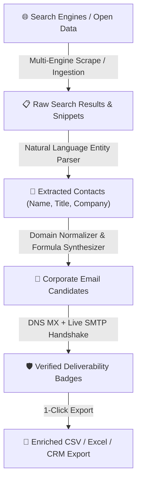
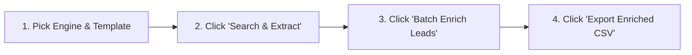
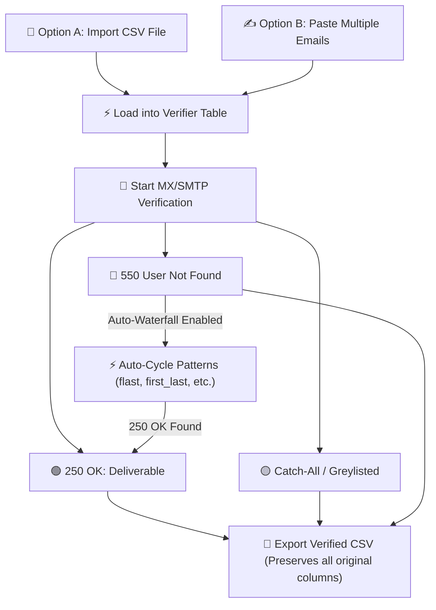
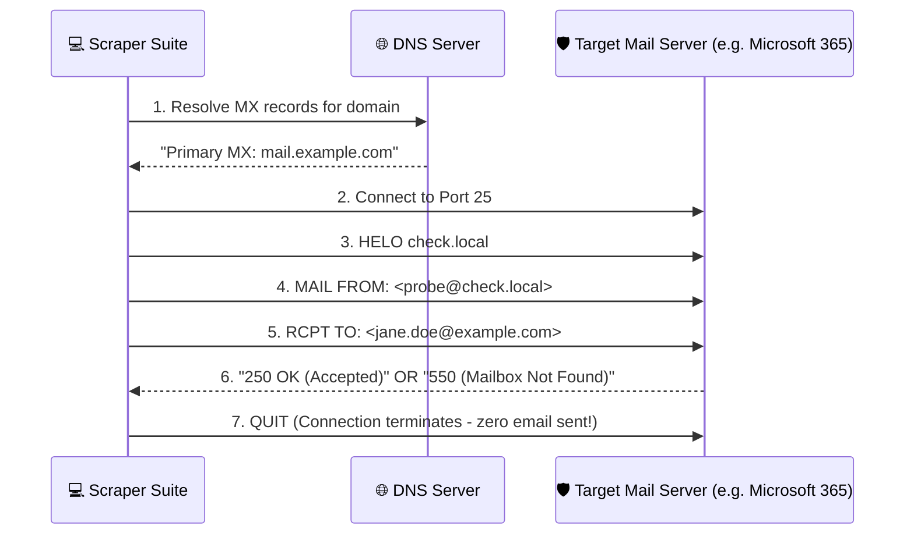
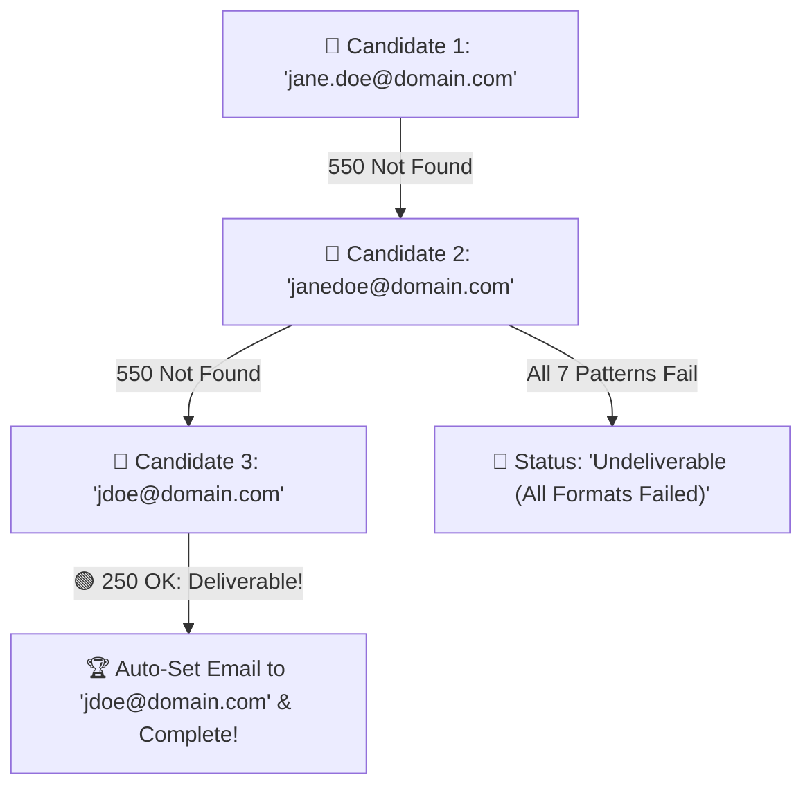
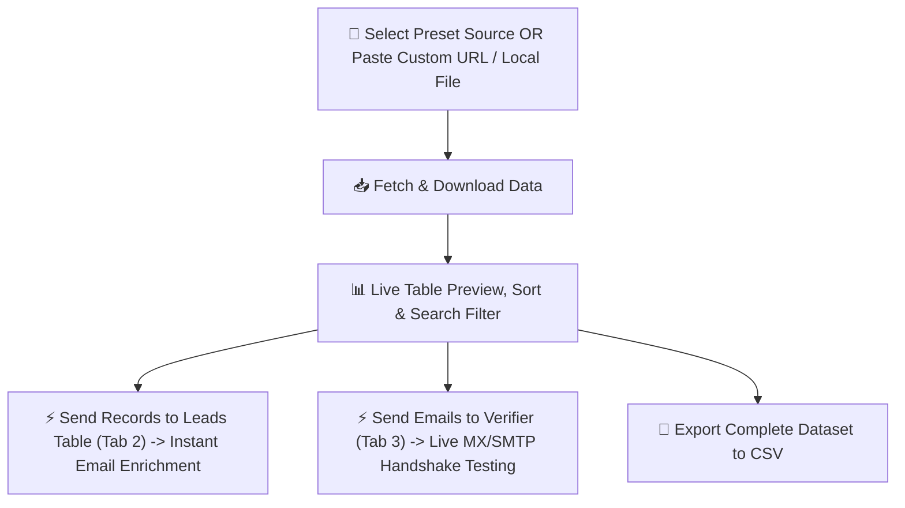

# 📖 Comprehensive User Guide & Technical Manual
### *The Complete Manual for Multi-Engine Scraping, Advanced Google Dorking, Lead Generation & Mailbox Verification*

Welcome to the **Multi-Engine Lead Extractor & Advanced Google Dork Scraping Suite**! This guide provides an exhaustive, step-by-step walkthrough of every feature, configuration setting, search strategy, and underlying technical mechanism in the application.

---

## 📑 Table of Contents
1. [Overview & Architecture](#1-overview--architecture)
2. [What is "Enrichment" & Why Do You Need It?](#2-what-is-enrichment--why-do-you-need-it)
3. [Quick Start: 4-Step Walkthrough](#3-quick-start-4-step-walkthrough)
4. [Exhaustive Tab-by-Tab Deep Dive](#4-exhaustive-tab-by-tab-deep-dive)
   - [Tab 1: Query Builder & Search Engine Controller](#tab-1-query-builder--search-engine-controller)
     - [Search Engine Selection Matrix](#search-engine-selection-matrix)
     - [Browser Visibility & Anti-Bot Settings](#browser-visibility--anti-bot-settings)
     - [Sub-Tab 1: Targeted Site & Profile Search (`site:`)](#sub-tab-1-targeted-site--profile-search-site)
     - [Sub-Tab 2: Generalized Multi-Group Boolean Query Builder](#sub-tab-2-generalized-multi-group-boolean-query-builder)
     - [Search Presets & 1-Click Templates](#search-presets--1-click-templates)
   - [Tab 2: Extracted Results & Lead Enrichment Studio](#tab-2-extracted-results--lead-enrichment-studio)
     - [Snippet Entity Parsing Pipeline](#snippet-entity-parsing-pipeline)
     - [Display Views & Interactive Controls](#display-views--interactive-controls)
     - [Column Sorting, Live Filtering & Selection](#column-sorting-live-filtering--selection)
     - [Batch vs. Single-Lead Enrichment](#batch-vs-single-lead-enrichment)
     - [Deliverability Status Badges](#deliverability-status-badges)
     - [Exporting Enriched CSV Datasets](#exporting-enriched-csv-datasets)
   - [Tab 3: Bulk Email & CSV Deliverability Verifier (DNS MX & SMTP Handshake)](#tab-3-bulk-email--csv-deliverability-verifier-dns-mx--smtp-handshake)
     - [Input Modes: CSV File Upload vs. Manual Paste](#input-modes-csv-file-upload-vs-manual-paste)
     - [The 2-Stage Verification Pipeline (DNS MX + Zero-Spam SMTP)](#the-2-stage-verification-pipeline-dns-mx--zero-spam-smtp)
     - [Auto-Waterfall Permutation Discovery Engine](#auto-waterfall-permutation-discovery-engine)
     - [Reformat & Retry Studio Modal](#reformat--retry-studio-modal)
     - [Preserving 100% of Original CSV Columns on Export](#preserving-100-of-original-csv-columns-on-export)
   - [Tab 4: Direct Open Data, Public Registers & Bulk File Importer](#tab-4-direct-open-data-public-registers--bulk-file-importer)
     - [Direct Open Data Downloads vs. Web Scraping](#direct-open-data-downloads-vs-web-scraping)
     - [Supported Formats (CSV, ZIP, XLSX, Web Tables)](#supported-formats-csv-zip-xlsx-web-tables)
     - [1-Click Bridges to Leads Table & Verifier](#1-click-bridges-to-leads-table--verifier)
     - [Saving Custom Registry Presets](#saving-custom-registry-presets)
   - [Tab 5: Search Operators Cheat Sheet & OSINT Recipes](#tab-5-search-operators-cheat-sheet--osint-recipes)
     - [Search Operators Reference](#search-operators-reference)
     - [Dev, Security & B2B Lead Gen Recipes](#dev-security--b2b-lead-gen-recipes)
   - [Tab 6: Search Query History Audit Log](#tab-6-search-query-history-audit-log)
5. [Configuring Enrichment Settings & Third-Party APIs](#5-configuring-enrichment-settings--third-party-apis)
6. [Local Background REST API Microservice (`http://127.0.0.1:8765`)](#6-local-background-rest-api-microservice-http1270018765)
7. [Extending Configuration Files & Database Architecture](#7-extending-configuration-files--database-architecture)
8. [Anti-Bot & Anti-CAPTCHA Best Practices](#8-anti-bot--anti-captcha-best-practices)
9. [Frequently Asked Questions & Troubleshooting](#9-frequently-asked-questions--troubleshooting)

---

## 1. Overview & Architecture

Finding high-value business leads, executive contacts, and facility data traditionally requires hours of manual searching, tab switching, guesswork, and expensive subscriptions.

This desktop application combines **Precision Search Query Engineering (Google Dorks)**, **Automated Multi-Engine Scraping**, **Natural Language Entity Extraction**, **Corporate Domain Normalization**, and **Direct Zero-Spam Mailbox Verification (DNS MX & SMTP Handshake)** into a single unified desktop suite.


```mermaid
graph TD
    A["🌐 Search Engines / Open Data"] -->|Multi-Engine Scrape / Ingestion| B["📋 Raw Search Results & Snippets"]
    B -->|Natural Language Entity Parser| C["👤 Extracted Contacts (Name, Title, Company)"]
    C -->|Domain Normalizer & Formula Synthesizer| D["📧 Corporate Email Candidates"]
    D -->|DNS MX + Live SMTP Handshake| E["🛡️ Verified Deliverability Badges"]
    E -->|1-Click Export| F["💾 Enriched CSV / Excel / CRM Export"]
```

---

## 2. What is "Enrichment" & Why Do You Need It?

### The Core Challenge
When scraping search engine snippets or public professional profiles (such as LinkedIn), the search engine displays public summaries:
> *"Jane Doe - Chief Technology Officer at Acme Global Technologies - London, UK"*

Direct email addresses are **rarely published in plain text** due to privacy settings and anti-spam measures.

### The 3-Stage Enrichment Solution
**Enrichment** is the automated process of taking a partial contact card and reconstructing their verified corporate email address through syntax modeling and live DNS/SMTP testing:

```
[Raw Scraped Contact] Jane Doe + Acme Global Technologies
       │
       ▼
[Stage 1: Domain Mapping]     Resolves company name to official domain: 'acmeglobal.com'
       │
       ▼
[Stage 2: Pattern Synthesis]  Constructs corporate naming standard: 'jane.doe@acmeglobal.com'
       │
       ▼
[Stage 3: Mail Server Check]  Pings live DNS MX records & performs zero-spam SMTP handshake
       │
       ▼
[Enriched Result]             🟢 Valid (MX Verified) | jane.doe@acmeglobal.com | 0ms bounce risk
```

---

## 3. Quick Start: 4-Step Walkthrough

Follow this 4-step walkthrough to extract and enrich leads in under two minutes:


```mermaid
graph LR
    A["1. Pick Engine & Template"] --> B["2. Click 'Search & Extract'"]
    B --> C["3. Click 'Batch Enrich Leads'"]
    C --> D["4. Click 'Export Enriched CSV'"]
```

### Step 1: Configure Your Search
1. Launch the application:
   ```bash
   python scraper_gui.py
   ```
2. In **Tab 1 (Query Builder & Presets)**, select your target search engine (e.g., **Google**, **Brave**, or **DuckDuckGo**).
3. Use the **`⚡ Ready-to-Use Search Templates`** dropdown to load a preset, or type your target keywords directly into **Sub-Tab 1 (Targeted Search)** or **Sub-Tab 2 (Generalized Boolean)**.

### Step 2: Run the Search
1. Set **Pages to Scrape** (e.g., `2` to `5` pages).
2. Set **Delay (sec)** (e.g., `2.0`s to prevent rate limits).
3. Click **`🚀 Search & Extract Leads`**. The application switches automatically to **Tab 2** and begins collecting results.

### Step 3: Enrich Contacts & Test Deliverability
1. Once scraping completes, inspect your extracted contacts in the **Interactive Table**.
2. Click **`⚡ Batch Enrich All`** at the top.
3. The engine automatically matches company domains, generates corporate email permutations, and executes live DNS MX mailbox checks.

### Step 4: Export Clean Spreadsheet
1. Click **`💾 Export Enriched CSV`**.
2. Choose your destination file path.
3. Open the spreadsheet in Microsoft Excel, Google Sheets, or import directly into your CRM (HubSpot, Salesforce, Apollo, etc.).

---

## 4. Exhaustive Tab-by-Tab Deep Dive

---

### Tab 1: Query Builder & Search Engine Controller

Tab 1 is the primary command center for configuring search engines, proxy settings, anti-bot mechanisms, and building precision search queries.

```
┌─────────────────────────────────────────────────────────────────────────────┐
│ 🌐 Search Engine: [Google ▼]   Delay: [2.0s]   Pages: [3]   [🔑 Google Login]│
├─────────────────────────────────────────────────────────────────────────────┤
│ 📂 Search Strategy:                                                         │
│  [🎯 Sub-Tab 1: Targeted Profile Search]  [🌐 Sub-Tab 2: Generalized Boolean]│
│  ┌───────────────────────────────────────────────────────────────────────┐  │
│  │ Target Site: site:linkedin.com/in/                                    │  │
│  │ Company / Org: "Acme Global" OR "TechCorp"                            │  │
│  │ Job Titles:    ("Chief Technology Officer" OR "VP Engineering")       │  │
│  │ Location:      "United Kingdom" OR "London"                           │  │
│  │ Exclusions:    -jobs -recruiter -careers                              │  │
│  └───────────────────────────────────────────────────────────────────────┘  │
│ [⚡ Live Query Preview & Syntax Bar                                      ]  │
│ [🚀 Search & Extract Leads]  [💾 Save Preset]  [📋 Copy Query]             │
└─────────────────────────────────────────────────────────────────────────────┘
```

#### Search Engine Selection Matrix

| Engine | Best Use-Case | CAPTCHA Probability | Scraping Characteristics |
| :--- | :--- | :--- | :--- |
| **🦁 Brave Search** | High-volume dorking & automated runs | **Zero / Very Low** | Highly resilient, fast response, no aggressive anti-bot challenges. |
| **🌐 Google** | Highest indexing depth & fresh snippet data | **Medium / High** | Best result quality; bypass challenges using the **`🔑 Google Login`** session. |
| **🦆 DuckDuckGo** | Privacy-centric open web dorking | **Low** | Clean snippets, great fallback for generic boolean queries. |
| **🟦 Bing** | Corporate, B2B & Microsoft-indexed profiles | **Low / Medium** | Excellent for enterprise organizations and LinkedIn profiles. |
| **🧅 Tor / Ahmia** | Deep web / Darknet `.onion` discovery | **Zero** | Direct Tor indexing (requires local Tor proxy on port 9050/9150). |

#### Browser Visibility & Anti-Bot Settings
- **👻 Silent Headless Mode (Default)**: Chrome operates 100% invisibly in the background with minimum RAM and CPU consumption.
- **🔘 Minimized Corner Window**: Keeps the browser parked as a small tile in the bottom-right corner of your display for visual monitoring without cluttering your workspace.
- **🖥️ Normal Window**: Launches a standard full-size browser window for manual inspection.
- **🔑 Google Authenticated Session**:
  1. Click **`🔑 Log in to Google`** in Tab 1.
  2. Log into your Google account in the opened Chrome instance.
  3. Close the browser. Your authenticated session cookies are stored locally and re-used for future queries, preventing robotic reCAPTCHA blocks.
- **🧅 Tor SOCKS5 Proxy Routing**: Check **`Route via Tor Proxy`** to route all traffic through `socks5://127.0.0.1:9050` or `9150` for anonymous scraping.

#### Sub-Tab 1: Targeted Site & Profile Search (`site:`)
Designed for laser-focused queries on specific platforms (e.g. LinkedIn, GitHub, StackOverflow, corporate intranets, or government registries):
- **Target Site (`site:`)**: Restricts search results to a specific domain or subdirectory (e.g. `site:linkedin.com/in/`, `site:github.com`, `site:gov.uk`).
- **Industry / Organisation**: Company name or sector keywords. Click **`+ Quotes/OR`** to wrap terms automatically in boolean operators.
- **Job Titles / Roles**: Target positions combined with boolean OR (e.g. `("Director" OR "VP" OR "Head of IT" OR "Lead Architect")`).
- **Location / Region**: Geographic boundaries (e.g. `"United Kingdom"`, `"San Francisco"`, `"Germany"`).
- **Contact Hunting Dorks**:
  - Check **`Public Emails`** to append patterns like `("@gmail.com" OR "@outlook.com" OR "@yahoo.com")`.
  - Check **`Phone / Tel`** to append phone hunting strings like `("phone" OR "tel" OR "mobile" OR "+44" OR "+1")`.
- **Negative Exclusions (`-`)**: Strips noise and irrelevant job listings (e.g. `-jobs -recruiter -hiring -careers -vacancies`).
- **Filetype (`filetype:`)**: Filters for specific file extensions (e.g. `filetype:pdf` for resumes/reports, `filetype:xlsx` for contact lists).

#### Sub-Tab 2: Generalized Multi-Group Boolean Query Builder
Designed for discovering commercial facilities, regional supply chains, tourism & hospitality chains, manufacturing hubs, and multi-site operations across the entire open web:
- **Group 1: Facility & Industry Terms (OR)**: Enter facility types or sectors (e.g. `("Hotels" OR "Restaurants" OR "Tour Operators" OR "Distribution Centre" OR "Manufacturing Plant")`).
- **Group 2: Operational Scale & Multi-Site Triggers (OR)**: Define operational footprint triggers (e.g. `("multiple locations" OR "chain" OR "depots across" OR "nationwide" OR "head office")`).
- **Group 3: Geographic Boundary Filters (OR)**: Define national or regional scope (e.g. `("United Kingdom" OR "England" OR "Europe" OR "United States")`).
- **Group 4: Negative Noise Exclusions (-)**: Exclude consumer aggregators, OTA booking portals, directories, and municipal portals (e.g. `-tripadvisor.com -booking.com -yell.com -yelp.com -directory -news`).
- **Modifiers**: Optional `intext:`, `inurl:`, or `intitle:` qualifiers.

#### Sub-Tab 3: Civil Services, Utilities & Public Bodies Query Builder
Dedicated multi-group boolean builder for researching public sector authorities, emergency services, local government, and critical utility networks with department and key contact matchers:
- **Group 1: Civil / Utility Sector (OR)**: Target specific civil bodies (e.g., `("Police" OR "Local Council" OR "NHS Trust" OR "Fire Service" OR "National Grid" OR "Cadent Gas" OR "Water Authority")`).
- **Group 2: Department / Functional Area (OR)**: Target functional areas across technology, environment, building control, security, procurement, estates, and fleet operations.
- **Group 3: Contact & Role Focus (OR)**: Target key officers (*"Head of"*, *"Director of"*, *"Chief Officer"*), direct contact numbers (*"switchboard"*, *"direct dial"*, *"helpline"*), official department email inboxes, or public registers & FOI disclosures.
- **Group 4: Geographic / Regional Scope (OR)**: UK-wide, England & London, Scotland, Wales, or Northern Ireland jurisdictions.
- **Group 5: Negative Noise Exclusions (-)**: Strip recruitment job boards (*Indeed, TotalJobs, Reed*), commercial directories (*Yell, 192*), and news/media noise.
- **Interactive Department Guide**: Click **`💡 Department Guide`** to open a comprehensive guide explaining how department names vary by sector (e.g. Council Planning vs Police ICT vs NHS Informatics vs Utility SCADA) with 1-click copyable queries.

#### Search Presets & 1-Click Templates
- Choose from dozens of pre-configured query templates across Civil Services & Utilities, Tourism & Hospitality, Fire Hazards, B2B Lead Generation, Tech Startups, Developer Debugging, Security OSINT, and Open Registries.
- Click **`Apply Template`** to populate all query builder fields instantly.
- Save custom templates permanently to `data/presets.json` by clicking **`💾 Save Current as Preset`**.

---

### Tab 2: Extracted Results & Lead Enrichment Studio

Tab 2 displays all scraped records and provides an interactive workbench for data cleaning, domain mapping, email synthesis, and deliverability verification.

```
┌─────────────────────────────────────────────────────────────────────────────┐
│ [⚡ Batch Enrich All] [⚡ Enrich Selected] [⚙️ Settings] [💾 Export CSV]     │
├─────────────────────────────────────────────────────────────────────────────┤
│ View: (•) Interactive Table  ( ) Structured Cards  ( ) CSV  ( ) Emails Only │
│ Filter: [🔍 Search Text...   ]  Org: [All Orgs ▼]  Status: [🟢 Valid Only ▼]│
├─────────────────────────────────────────────────────────────────────────────┤
│ Name       │ Job Title        │ Organisation │ Enriched Email │ Deliverability│
├────────────┼──────────────────┼──────────────┼────────────────┼───────────────┤
│ Jane Doe   │ CTO              │ Acme Corp    │ jane.doe@acme  │ 🟢 Valid (MX) │
│ John Smith │ Head of Systems  │ TechGlobal   │ jsmith@techglo │ 🟢 Valid (MX) │
└─────────────────────────────────────────────────────────────────────────────┘
```

#### Snippet Entity Parsing Pipeline
When scraping completes, the entity parsing engine processes raw search titles and snippet descriptions through a multi-pass regex pipeline:
1. **Name Extraction**: Isolates First Name and Surname from title prefixes (stripping trailing platform names like `| LinkedIn`).
2. **Role & Title Normalization**: Extracts professional titles (*"Chief Information Officer"*, *"Head of Procurement"*, *"Project Manager"*).
3. **Organisation Identification**: Identifies employer and company names from delimiter tokens (`at`, `@`, `-`, `|`, `•`).
4. **Link Normalization**: Extracts clean canonical URLs for one-click browser opening.

#### Display Views & Interactive Controls
Switch between 6 specialized views depending on your workflow:
1. **📋 Interactive Table (Default)**: Full multi-column spreadsheet view with live sorting and color-coded status badges.
2. **🃏 Structured Cards**: Formatted visual cards showing full contact biographies and snippet text.
3. **📊 Excel TSV**: Tab-separated plaintext format ready for direct pasting into Microsoft Excel.
4. **📑 CSV Format**: Standard comma-separated values format.
5. **✉️ Emails Only**: Clean deduplicated list of discovered email addresses for instant copying.
6. **🔗 URLs Only**: Plain list of profile and webpage source URLs.

#### Column Sorting, Live Filtering & Selection
- **Column Sorting**: Click any column header (e.g. **`Organisation`**, **`Job Title`**, **`Deliverability`**) to toggle ascending (**▲ A-Z**) and descending (**▼ Z-A**) sorting.
- **Filter by Organisation Dropdown**: Isolate contacts from a single company with live record count indicators.
- **Filter by Deliverability Status**: Filter the view to display only `🟢 Valid`, `🟡 Risky`, or unverified contacts.
- **Multi-Line Selection**: Hold **`Ctrl`** to pick individual rows or **`Shift`** to select contiguous blocks of leads.
- **Right-Click Context Menu**:
  - ⚡ *Enrich Selected Contact(s)*
  - 🏢 *Filter Table by this Organisation*
  - ✉️ *Copy Email Address*
  - 📋 *Copy Full Row Details*
  - 🌐 *Open Profile URL in Web Browser*

#### Batch vs. Single-Lead Enrichment
- **`⚡ Batch Enrich All`**: Iterates through the entire dataset, resolves domains, synthesizes corporate email permutations, and performs live DNS MX checks.
- **`⚡ Enrich Selected`**: Runs enrichment and mail server verification exclusively on highlighted rows.

#### Deliverability Status Badges

| Badge | Status | Description | CRM Safety |
| :--- | :--- | :--- | :--- |
| `🟢 Valid (MX Verified)` | **Verified Active** | The domain is active and verified by live DNS MX mail exchange records (e.g. Microsoft 365, Google Workspace, Mimecast). | **100% Safe** (Zero bounce risk) |
| `🟡 Risky` | **Catch-All / Unconfirmed** | Domain has active MX records, but server operates a catch-all policy or greylisting delay. | **Caution** (Monitor deliverability) |
| `⚪ Not Found` | **Missing Domain Mapping** | Organisation name could not be mapped to a known corporate domain. | Set custom fallback domain in **⚙️ Settings** |
| `🔴 Invalid (No MX)` | **Non-Existent Mail Domain** | Domain has no registered DNS MX records or name servers failed to resolve. | **Do Not Send** |

#### Exporting Enriched CSV Datasets
Click **`💾 Export Enriched CSV`** to export a clean, CRM-ready spreadsheet containing:
`First Name`, `Last Name`, `Full Name`, `Job Title / Role`, `Organisation`, `Resolved Domain`, `Enriched Email`, `Deliverability Status`, `MX Server Host`, `Phone`, `Profile URL`.

---

### Tab 3: Bulk Email & CSV Deliverability Verifier (DNS MX & SMTP Handshake)

Tab 3 is a dedicated deliverability testing suite that verifies external email lists and CSV files using direct **DNS MX resolution** and live **SMTP Handshakes** without sending actual test emails.


```mermaid
graph TD
    A1["📂 Option A: Import CSV File"] --> C["⚡ Load into Verifier Table"]
    A2["✍️ Option B: Paste Multiple Emails"] --> C
    C --> D["🚀 Start MX/SMTP Verification"]
    D --> E1["🟢 250 OK: Deliverable"]
    D --> E2["🟡 Catch-All / Greylisted"]
    D --> E3["🔴 550 User Not Found"]
    E3 -->|Auto-Waterfall Enabled| F["⚡ Auto-Cycle Patterns (flast, first_last, etc.)"]
    F -->|250 OK Found| E1
    E1 --> G["💾 Export Verified CSV (Preserves all original columns)"]
    E2 --> G
    E3 --> G
```

#### Input Modes: CSV File Upload vs. Manual Paste
1. **📂 Option A (CSV File Import)**:
   - Click **`📂 Browse CSV...`** and select any external spreadsheet (e.g., `sales_prospects.csv`).
   - The app auto-detects the email column (e.g. `Email`, `Contact_Email`, `Work_Email`) or lets you choose it from a dropdown.
   - Click **`⚡ Load CSV into Verifier`**.
2. **✍️ Option B (Multi-Line Manual Paste)**:
   - Paste raw emails, comma-separated lists, or formatted lines (e.g., `Jane Doe <jane.doe@example.com>`).
   - Click **`⚡ Load Pasted Emails into Verifier`**.

#### The 2-Stage Verification Pipeline (DNS MX + Zero-Spam SMTP)
The verification pipeline connects directly to the recipient's official mail gateway:


```mermaid
sequenceDiagram
    participant App as 💻 Scraper Suite
    participant DNS as 🌐 DNS Server
    participant MX as 🛡️ Target Mail Server (e.g. Microsoft 365)
    
    App->>DNS: 1. Resolve MX records for domain
    DNS-->>App: "Primary MX: mail.example.com"
    App->>MX: 2. Connect to Port 25
    App->>MX: 3. HELO check.local
    App->>MX: 4. MAIL FROM: <probe@check.local>
    App->>MX: 5. RCPT TO: <jane.doe@example.com>
    MX-->>App: 6. "250 OK (Accepted)" OR "550 (Mailbox Not Found)"
    App->>MX: 7. QUIT (Connection terminates - zero email sent!)
```

#### Auto-Waterfall Permutation Discovery Engine
When an email address returns `550 User Not Found`, the **Auto-Waterfall Engine** automatically tests alternate corporate naming formulas in prioritized order:


```mermaid
graph TD
    A["📧 Candidate 1: 'jane.doe@domain.com'"] -->|550 Not Found| B["📧 Candidate 2: 'janedoe@domain.com'"]
    B -->|550 Not Found| C["📧 Candidate 3: 'jdoe@domain.com'"]
    C -->|🟢 250 OK: Deliverable!| D["🏆 Auto-Set Email to 'jdoe@domain.com' & Complete!"]
    B -->|All 7 Patterns Fail| E["🔴 Status: 'Undeliverable (All Formats Failed)'"]
```

Prioritized Waterfall Sequence:
1. `{first}.{last}` (`jane.doe@company.com`)
2. `{first}{last}` (`janedoe@company.com`)
3. `{f}{last}` (`jdoe@company.com`)
4. `{first}_{last}` (`jane_doe@company.com`)
5. `{last}.{first}` (`doe.jane@company.com`)
6. `{last}{f}` (`doej@company.com`)
7. `{first}` (`jane@company.com`)

#### Reformat & Retry Studio Modal
- Click **`🔄 Reformat & Retry Undeliverables...`** to open the interactive studio.
- Select failed contacts, apply candidate email formulas in bulk, run live SMTP tests on the fly, and click **`📥 Apply & Update Main Table`** to update valid emails back into your dataset.

#### Preserving 100% of Original CSV Columns on Export
When exporting verified CSVs (**`💾 Export Verified CSV`**), **all original columns and metadata from your imported file are 100% preserved**, with new verification columns appended:
`Verification_Status`, `Deliverability_Badge`, `Primary_MX_Host`, `SMTP_Response_Code`, `Response_Time_MS`.

---

### Tab 4: Direct Open Data, Public Registers & Bulk File Importer

Tab 4 enables direct bulk data ingestion from national public registers, open data portals, and corporate directories without running search engine queries.


```mermaid
graph TD
    A["📜 Select Preset Source OR Paste Custom URL / Local File"] --> B["📥 Fetch & Download Data"]
    B --> C["📊 Live Table Preview, Sort & Search Filter"]
    C --> D1["⚡ Send Records to Leads Table (Tab 2) -> Instant Email Enrichment"]
    C --> D2["⚡ Send Emails to Verifier (Tab 3) -> Live MX/SMTP Handshake Testing"]
    C --> D3["💾 Export Complete Dataset to CSV"]
```

#### Direct Open Data Downloads vs. Web Scraping
- **Zero Search Rate Limits**: Open data files are downloaded directly from host servers in one single HTTP request.
- **Zero CAPTCHAs**: Bypasses search engine bot protection entirely.
- **Thousands of Records**: Ingests complete national registers and directory spreadsheets in seconds.

#### Supported Formats (CSV, ZIP, XLSX, Web Tables)
- **Direct CSV Downloads**: Auto-parsed into tabular format.
- **Compressed ZIP Archives**: In-memory decompression of contained `.csv` datasets.
- **Excel Spreadsheets (`.xlsx`)**: Parses structured sheets.
- **HTML Web Directory Tables**: Automatically scrapes and extracts tabular rows from online directories.
- **Local Disk Ingestion**: Click **`📂 Local File...`** to ingest `.csv` or `.zip` files from your computer.

#### 1-Click Bridges to Leads Table & Verifier
- **`⚡ Send to Leads Table (Tab 2)`**: Maps parsed business names and contact fields directly into Tab 2 for instant batch domain resolution and email synthesis.
- **`⚡ Send to Verifier (Tab 3)`**: Sends extracted email columns directly to Tab 3 for bulk MX and SMTP handshake verification.

#### Saving Custom Registry Presets
1. Enter your download link into **`Registry URL:`**.
2. Enter a friendly title into **`Label / Name:`** (e.g. *"National Transport Operators Directory"*).
3. Click **`💾 Save to List`**. The source is saved permanently to `data/registry_sources.json`.

---

### Tab 5: Search Operators Cheat Sheet & OSINT Recipes

Tab 5 provides an interactive library of advanced search operators and ready-to-run dork templates with mouse-wheel scrolling and 1-click query loading.

#### Search Operators Reference

| Operator | Syntax Example | Purpose |
| :--- | :--- | :--- |
| `site:` | `site:linkedin.com/in/` | Restricts search results exclusively to a specific domain or path. |
| `intext:` | `intext:"distribution centre"` | Requires the exact term to appear in the page body. |
| `intitle:` | `intitle:"Chief Information Officer"` | Requires the exact phrase to exist in the HTML `<title>`. |
| `inurl:` | `inurl:contacts` | Requires the term to exist within the URL string. |
| `filetype:` | `filetype:pdf` | Restricts results to specific file types (`pdf`, `xlsx`, `docx`, `csv`, `config`, `env`). |
| `OR` / `\|` | `"Director" OR "VP"` | Matches either term (must be uppercase `OR` or pipe `\|`). |
| `""` (Quotes) | `"Acme Global Technologies"` | Exact phrase matching (words must appear in exact order). |
| `-` (Minus) | `-jobs -careers -recruiter` | Excludes pages containing specified words. |
| `..` (Range) | `$500..$2000` or `2022..2025` | Number and year range matching. |
| `after:` / `before:` | `after:2024-01-01` | Filters results published after or before a specific date. |

#### Dev, Security & B2B Lead Gen Recipes
- **Developer Debugging**: `site:stackoverflow.com OR site:github.com "TypeError: Cannot read properties"`
- **Exposed Assets & Configs**: `filetype:env "DB_PASSWORD" OR "API_KEY"`
- **Open Directory Indexes**: `intext:"index of /" -inurl:(jsp|php|html|aspx|htm)`
- **Executive Resume Hunter**: `("Chief Technology Officer" OR "VP Engineering") "curriculum vitae" OR "resume" filetype:pdf`
- **Public Contact List Extractor**: `site:gov.uk (filetype:xlsx OR filetype:csv) "contact list" OR "directory"`

---

### Tab 6: Search Query History Audit Log

- **Automatic Timestamping**: Logs every executed search query, search engine used, and total leads captured to SQLite (`db/scraper_storage.db`) and `search_history.log`.
- **1-Click Query Recall**: Select any historical search and click **`⚡ Recall Selected into Builder`** to reload the query parameters into Tab 1.

---

## 5. Configuring Enrichment Settings & Third-Party APIs

Click **`⚙️ Enrichment Settings`** in Tab 2 to configure domain mappings, naming standards, and optional external APIs:

```
┌─────────────────────────────────────────────────────────────────────────────┐
│ ⚙️ Enrichment Configuration Studio                                          │
├─────────────────────────────────────────────────────────────────────────────┤
│ 1. Sector Domain Dictionary: [General Business / Tech Startups ▼]           │
│ 2. Custom Domain Fallback:   [example-corp.com                            ] │
│ 3. Email Pattern Formula:    [{first}.{last}@{domain}                     ▼]│
│ 4. Optional API Keys:                                                       │
│    • Hunter.io API Key:      [********************************]             │
│    • Apollo.io API Key:      [********************************]             │
│    • Snov.io API Key:        [********************************]             │
│ [💾 Save Settings]  [🔄 Reset to Built-In Defaults]                         │
└─────────────────────────────────────────────────────────────────────────────┘
```

### 1. Sector Domain Dictionary
Select from pre-loaded industry dictionaries or select **Custom / General Business**.

### 2. Custom Domain Fallback
Specify a default company domain (e.g. `acme-corp.com`) to be applied whenever an extracted company name cannot be mapped automatically.

### 3. Corporate Email Pattern Standard
Select your target naming standard:
- `{first}.{last}@{domain}` *(e.g. `jane.doe@company.com`)*
- `{f}{last}@{domain}` *(e.g. `jdoe@company.com`)*
- `{first}{last}@{domain}` *(e.g. `janedoe@company.com`)*
- `{first}_{last}@{domain}` *(e.g. `jane_doe@company.com`)*
- `{last}.{first}@{domain}` *(e.g. `doe.jane@company.com`)*

### 4. External Enrichment API Integrations (Optional)
The application includes a **100% Free Built-in DNS MX Verifier**. If you have an account with external enrichment services, you can optionally supply your API keys for multi-provider fallback.

---

## 6. Local Background REST API Microservice (`http://127.0.0.1:8765`)

The desktop application starts an embedded background REST API microservice on `127.0.0.1:8765` to allow other scripts and workflows to leverage the enrichment engine programmatically.

### Health Check Endpoint
- **URL**: `GET http://127.0.0.1:8765/api/health`
- **Response**:
  ```json
  {
    "status": "healthy",
    "version": "2.0",
    "service": "Lead Enrichment & MX Verifier Engine"
  }
  ```

### Contact Enrichment Endpoint
- **URL**: `POST http://127.0.0.1:8765/api/enrich`
- **Request Headers**: `Content-Type: application/json`
- **Request Body**:
  ```json
  {
    "full_name": "Jane Doe",
    "headline": "Chief Technology Officer",
    "organisation": "Acme Global Technologies"
  }
  ```
- **Response**:
  ```json
  {
    "status": "success",
    "first_name": "Jane",
    "last_name": "Doe",
    "job_title": "Chief Technology Officer",
    "organisation": "Acme Global Technologies",
    "domain": "acmeglobal.com",
    "email": "jane.doe@acmeglobal.com",
    "deliverability": "Valid (MX Verified)",
    "mx_host": "mail.protection.outlook.com"
  }
  ```

### Python Integration Example
```python
import requests

payload = {
    "full_name": "Jane Doe",
    "headline": "VP of Engineering",
    "organisation": "Acme Global Technologies"
}

res = requests.post("http://127.0.0.1:8765/api/enrich", json=payload)
print(res.json())
```

---

## 7. Extending Configuration Files & Database Architecture

The application follows a **Hybrid Storage Model** separating UI presentation from dynamic configurations and transactional database state:

```
Google Scrape/
├── data/
│   ├── domains.json           # Sector & company domain dictionaries
│   ├── presets.json           # Targeted profile & generalized search templates
│   ├── dorks_cheatsheet.json  # Search operators, dev recipes & OSINT templates
│   └── registry_sources.json  # Open data download sources & registry URLs
└── db/
    └── scraper_storage.db     # Persistent DNS MX Cache, Query History & Leads DB
```

### Adding Custom Domains (`data/domains.json`)
Open [data/domains.json](data/domains.json) to add custom sector dictionaries or company domain mappings without touching Python code:
```json
{
  "my_custom_sector": {
    "acme global": "acmeglobal.com",
    "apex logistics": "apexlogistics.io"
  }
}
```

### Adding Custom Presets (`data/presets.json`)
Open [data/presets.json](data/presets.json) to add reusable search query templates:
```json
{
  "targeted_presets": {
    "fintech_ctos": {
      "site": "site:linkedin.com/in/",
      "org": "(\"FinTech\" OR \"Challenger Bank\")",
      "titles": "(\"Chief Technology Officer\" OR \"VP Engineering\")",
      "location": "\"United Kingdom\" OR \"London\"",
      "exclude": "-jobs -recruiter -careers",
      "filetype": "None",
      "email_dork": false,
      "phone_dork": false,
      "custom_email_domain": ""
    }
  }
}
```

### Persistent DNS MX Cache (`db/scraper_storage.db`)
- Every DNS MX lookup is stored in SQLite.
- Subsequent verification passes execute at **0ms in-memory/disk speed** with zero network DNS round-trips.

---

## 8. Anti-Bot & Anti-CAPTCHA Best Practices

### 1. Maintain an Authenticated Google Session
- Click **`🔑 Log in to Google`** in Tab 1 once. Your authenticated profile cookies will persist across app restarts, minimizing bot detection.

### 2. Set Sensible Scraping Delays
- When scraping 5+ pages on Google, set **Delay (sec)** to `2.0` or `3.0` seconds.
- For high-volume automated dorking, switch to **`🦁 Brave Search`** or **`🦆 DuckDuckGo`** which do not enforce aggressive rate limits.

### 3. Port 25 SMTP Considerations
- Direct SMTP handshake verification connects to remote mail servers on TCP Port 25.
- Certain residential Internet Service Providers (ISPs) or corporate VPN firewalls block outbound Port 25 traffic by default. If SMTP handshakes timeout, ensure outbound port 25 is permitted on your network.

---

## 9. Frequently Asked Questions & Troubleshooting

### Q: Why does a contact show "⚪ Not Found"?
**A:** The organisation name could not be automatically mapped to a known domain in `domains.json`. Open **⚙️ Enrichment Settings** and enter a **Custom Domain Fallback** (e.g. `example.com`), then click **`⚡ Batch Enrich All`** again.

### Q: Why are my SMTP handshakes timing out?
**A:** Check if your network or ISP blocks outbound connections on **Port 25**. If Port 25 is restricted, DNS MX verification will still resolve live mail gateways (`🟢 Valid (MX Verified)`), while SMTP mailbox probing will fall back gracefully.

### Q: How do I export data to Excel or CRM?
**A:** Click **`💾 Export Enriched CSV`** in Tab 2 or **`💾 Export Verified CSV`** in Tab 3. The exported `.csv` file can be opened directly in Excel or imported into Salesforce, HubSpot, or Apollo.

### Q: How can I add new search engines or dork recipes?
**A:** You can edit [data/dorks_cheatsheet.json](data/dorks_cheatsheet.json) or [data/presets.json](data/presets.json) at any time; changes take effect immediately on next app launch.

---

*For technical questions, bug reports, or feature requests, consult [README.md](README.md) or inspect the application source code in [scraper_gui.py](scraper_gui.py).*
